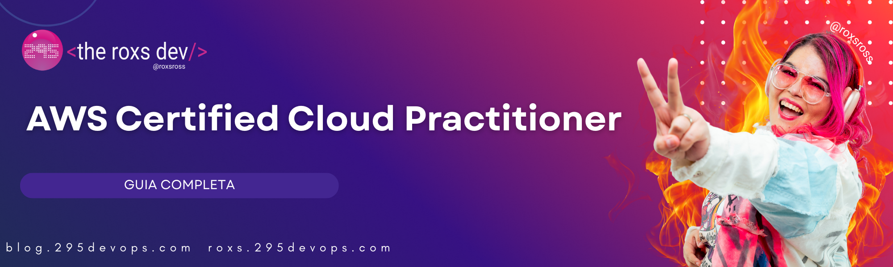
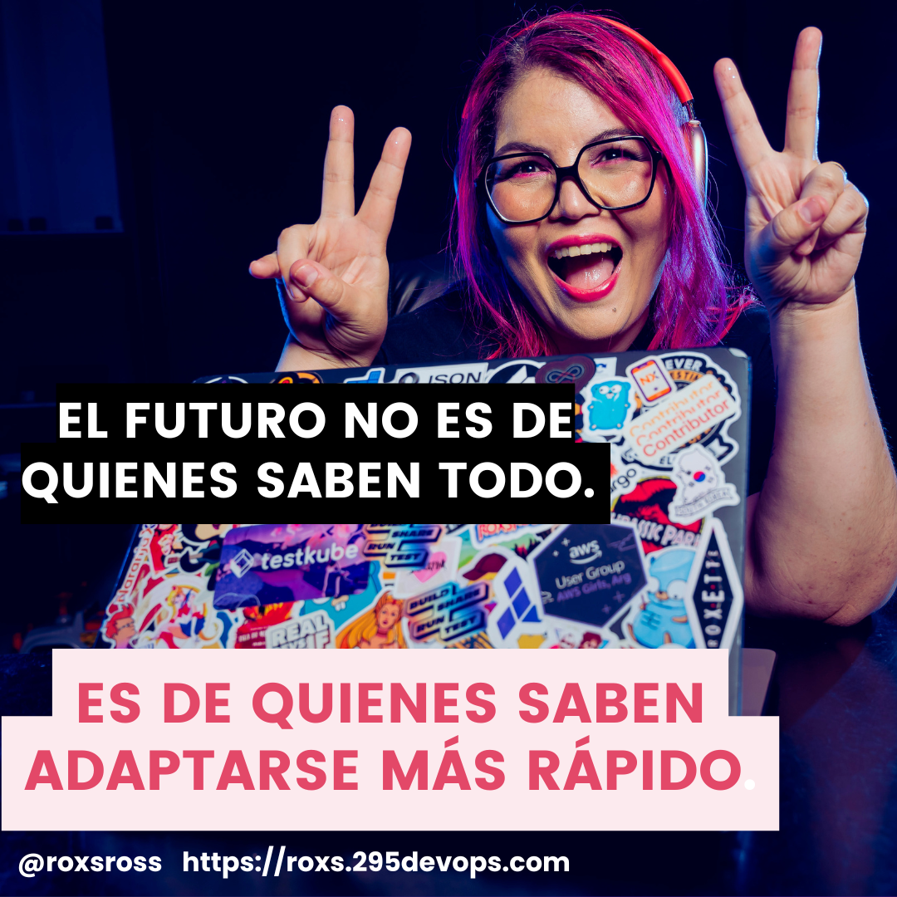

# 🚀 AWS Certified Cloud Practitioner - Guía de Estudio Completa



[](https://aws.amazon.com/certification/certified-cloud-practitioner/)
[](https://github.com/roxsross/aws-cloud-practitioner-complete-guide)
[](https://github.com/roxsross/aws-cloud-practitioner-complete-guide)
[](https://opensource.org/licenses/MIT)

> 🎯 **Tu guía definitiva y completa para conquistar la certificación AWS Cloud Practitioner** - Desde conceptos básicos hasta el éxito en el examen, todo lo que necesitas está aquí. ¡Transforma tu carrera en la nube! ☁️✨

<div align="center">
  
</div>

## 📋 Tabla de Contenidos

- [🎯 Acerca de Esta Guía](#-acerca-de-esta-guía)
- [📊 Resumen del Examen](#-resumen-del-examen)
- [📚 Secciones de Estudio](#-secciones-de-estudio)
- [🗓️ Plan de Estudio](#️-plan-de-estudio)
- [💡 Consejos Rápidos](#-consejos-rápidos)
- [🔗 Navegación](#-navegación)

---

## 🎯 Acerca de Esta Guía

¡Bienvenido a tu **viaje completo de certificación AWS Cloud Practitioner**! Esta guía está diseñada para ser tu **único recurso** necesario para aprobar el examen. No se requieren referencias externas: ¡todo está aquí!

### ¿Qué Hace Especial a Esta Guía?
- ✅ **100% Autocontenida** - No necesitas recursos externos
- ✅ **Aprendizaje Interactivo** - Ejemplos prácticos y escenarios
- ✅ **Contexto del Mundo Real** - Analogías y casos de uso relacionables
- ✅ **Cobertura Integral** - Cada tema del examen cubierto en detalle
- ✅ **Navegación Fácil** - Secciones bien organizadas y referencias cruzadas

---

## 📊 Resumen del Examen

### 🎓 AWS Certified Cloud Practitioner (CLF-C02)

| **Aspecto** | **Detalles** |
|-------------|--------------|
| **Duración** | 90 minutos |
| **Formato** | Opción múltiple y respuesta múltiple |
| **Preguntas** | 65 preguntas |
| **Puntuación para Aprobar** | 700 de 1000 |
| **Costo** | $100 USD |
| **Validez** | 3 años |
| **Prerrequisitos** | Ninguno (nivel de entrada) |

### 🎯 Dominios del Examen y Ponderaciones

| **Dominio** | **Peso** | **Descripción** |
|-------------|----------|-----------------|
| **1. Conceptos de la Nube** | 24% | Comprensión de los fundamentos de la computación en la nube |
| **2. Seguridad y Cumplimiento** | 30% | Modelo de seguridad y cumplimiento de AWS |
| **3. Tecnología y Servicios de la Nube** | 34% | Servicios principales de AWS y arquitectura |
| **4. Facturación, Precios y Soporte** | 12% | Gestión de costos y opciones de soporte |

### 🏆 Audiencia Objetivo
- **Profesionales de TI** comenzando su viaje en la nube
- **Líderes Empresariales** que desean alfabetización en la nube
- **Estudiantes** iniciando certificaciones de AWS
- **Personas que Cambian de Carrera** ingresando a la computación en la nube
- **Cualquier persona** curiosa sobre los fundamentos de AWS

---

## 📚 Secciones de Estudio

### 🌩️ [Dominio 1: Conceptos de la Nube](./01-cloud-concepts/README.md)
**Peso: 24% | Tiempo de Estudio: ~15 horas**

Aprende los conceptos fundamentales de la computación en la nube:
- ¿Qué es la computación en la nube?
- Beneficios y ventajas
- Modelos de implementación en la nube
- Modelos de servicio en la nube
- Infraestructura Global de AWS

**Temas Clave:**
- Comparación entre local vs Nube
- Seis ventajas de la computación en la nube
- Nubes Públicas, Privadas e Híbridas
- Modelos IaaS, PaaS y SaaS
- Regiones, Zonas de Disponibilidad y Ubicaciones de Borde

---

### 🔒 [Dominio 2: Seguridad y Cumplimiento](./02-security-compliance/README.md)
**Peso: 30% | Tiempo de Estudio: ~20 horas**

Domina el marco de seguridad y cumplimiento de AWS:
- Modelo de Responsabilidad Compartida
- AWS Identity and Access Management (IAM)
- Servicios y características de seguridad
- Programas de cumplimiento

**Temas Clave:**
- Responsabilidades de AWS vs Cliente
- Usuarios, Grupos, Roles y Políticas
- Autenticación Multifactor (MFA)
- Resumen de servicios de seguridad de AWS
- Certificaciones de cumplimiento

---

### ⚙️ [Dominio 3: Tecnología y Servicios de la Nube](./03-technology-services/README.md)
**Peso: 34% | Tiempo de Estudio: ~25 horas**

Explora los servicios principales de AWS y la arquitectura:
- Servicios de cómputo (EC2, Lambda, etc.)
- Servicios de almacenamiento (S3, EBS, etc.)
- Servicios de red (VPC, CloudFront, etc.)
- Servicios de base de datos (RDS, DynamoDB, etc.)
- Servicios clave adicionales

**Temas Clave:**
- Amazon EC2 y servicios relacionados
- Amazon S3 y opciones de almacenamiento
- Virtual Private Cloud (VPC)
- Soluciones de base de datos
- Servicios de integración de aplicaciones

---

### 💰 [Dominio 4: Facturación, Precios y Soporte](./04-billing-support/README.md)
**Peso: 12% | Tiempo de Estudio: ~10 horas**

Comprende los precios y soporte de AWS:
- Modelos de precios de AWS
- Herramientas de gestión de costos
- Planes de soporte y recursos
- AWS Organizations y facturación

**Temas Clave:**
- Precios de pago por uso
- Instancias Reservadas y Planes de Ahorro
- Calculadora de Costos de AWS y presupuestos
- Comparación de planes de soporte
- Consolidación de facturación

---

### 🎯 [Preparación Final y Horarios de Estudio](./final-prep/README.md)
**Esencial para el éxito del examen | Tiempo de Estudio: Fase de revisión**

Recursos integrales de preparación final:
- Plan de revisión final de 7 días
- Múltiples opciones de horarios de estudio (2 semanas, 4 semanas, 8 semanas)
- Estrategias y listas de verificación para el día del examen
- Técnicas de memoria y revisión de último minuto
- Plantillas de seguimiento de progreso

**Características Clave:**
- Horarios de estudio estructurados para diferentes cronogramas
- Lista de verificación del día del examen y preparación mental
- Técnica de palacio de memoria para recordar servicios
- Errores comunes a evitar
- Estrategia de revisión de la semana final

---

## 🗓️ Plan de Estudio

### 📅 Plan Intensivo de 4 Semanas
Perfecto para estudiantes dedicados con 2-3 horas de estudio diario.

| **Semana** | **Área de Enfoque** | **Horas Diarias** | **Horas Totales** |
|------------|---------------------|-------------------|-------------------|
| **Semana 1** | Conceptos de la Nube + Fundamentos de Seguridad | 2.5 horas | 17.5 horas |
| **Semana 2** | Inmersión Profunda en Seguridad y Cumplimiento | 3 horas | 21 horas |
| **Semana 3** | Tecnología y Servicios | 3.5 horas | 24.5 horas |
| **Semana 4** | Facturación + Revisión + Práctica | 2 horas | 14 horas |
| **Total** | | | **77 horas** |

### 📅 Plan Equilibrado de 8 Semanas
Ideal para profesionales trabajadores con tiempo limitado.

| **Semana** | **Área de Enfoque** | **Horas Diarias** | **Horas Totales** |
|------------|---------------------|-------------------|-------------------|
| **Semana 1-2** | Conceptos de la Nube | 1.5 horas | 21 horas |
| **Semana 3-4** | Seguridad y Cumplimiento | 1.5 horas | 21 horas |
| **Semana 5-6** | Tecnología y Servicios | 2 horas | 28 horas |
| **Semana 7** | Facturación y Precios | 1.5 horas | 10.5 horas |
| **Semana 8** | Revisión y Práctica | 1 hora | 7 horas |
| **Total** | | | **87.5 horas** |

### 📅 Plan Relajado de 12 Semanas
Perfecto para principiantes o aquellos con tiempo muy limitado.

| **Semana** | **Área de Enfoque** | **Horas Semanales** |
|------------|---------------------|---------------------|
| **Semana 1-3** | Conceptos de la Nube | 6 horas/semana |
| **Semana 4-6** | Seguridad y Cumplimiento | 7 horas/semana |
| **Semana 7-9** | Tecnología y Servicios | 8 horas/semana |
| **Semana 10-11** | Facturación y Revisión | 5 horas/semana |
| **Semana 12** | Práctica Final | 4 horas |

---

## 💡 Consejos Rápidos

### 🚀 Estrategias de Estudio
- **🎯 Enfócate en entender conceptos**, no en memorizar
- **📝 Toma notas** con tus propias palabras
- **🔄 Revisa regularmente** para reforzar el aprendizaje
- **💪 Practica con escenarios** proporcionados en cada sección
- **❓ Usa las preguntas de quiz** al final de cada módulo

### 📖 Consejos de Lectura
- **📚 Lee activamente** - involúcrate con el contenido
- **🔗 Sigue las referencias cruzadas** a temas relacionados
- **⏰ Toma descansos** cada 45-60 minutos
- **📱 Usa marcadores** para secciones importantes

### 🎯 Consejos para el Examen
- **⏰ Gestión del tiempo** - no pases demasiado tiempo en una pregunta
- **❌ Elimina respuestas incorrectas** primero
- **🔄 Revisa preguntas marcadas** al final
- **🧘 Mantén la calma** y confía en tu preparación

---

## 🔗 Navegación

### 📁 Estructura del Repositorio
```
AWS-Cloud-Practitioner-Guide/
├── README.md (¡Estás aquí!)
├── 01-cloud-concepts/
│   ├── README.md
│   ├── what-is-cloud.md
│   ├── cloud-benefits.md
│   ├── deployment-models.md
│   ├── service-models.md
│   └── aws-infrastructure.md
├── 02-security-compliance/
│   ├── README.md
│   ├── shared-responsibility.md
│   ├── iam-fundamentals.md
│   ├── security-services.md
│   └── compliance.md
├── 03-technology-services/
│   ├── README.md
│   ├── compute-services.md
│   ├── storage-services.md
│   ├── networking-services.md
│   ├── database-services.md
│   └── additional-services.md
├── 04-billing-support/
│   ├── README.md
│   ├── pricing-models.md
│   ├── cost-management.md
│   └── support-plans.md
├── practice-exams/
│   ├── practice-exam-1.md
│   ├── practice-exam-2.md
│   └── practice-exam-3.md
├── quick-reference/
│   ├── service-cheatsheet.md
│   ├── exam-tips.md
│   └── glossary.md
└── final-prep/
    ├── README.md
    ├── study-schedules.md
    └── progress-checklist.md
```

### 🗺️ Cómo Navegar
1. **Comienza aquí** con el README (página actual)
2. **Sigue el plan de estudio sugerido** o crea el tuyo propio
3. **Comienza con el Dominio 1** y progresa secuencialmente
4. **Usa referencias cruzadas** para saltar entre temas relacionados
5. **Practica regularmente** con las preguntas de quiz
6. **Revisa la referencia rápida** antes de tu examen

---

## 🎉 ¿Listo para Comenzar?

**Elige tu punto de partida:**

🌩️ **[Comienza con Conceptos de la Nube →](./01-cloud-concepts/README.md)**

🔒 **[Salta a Seguridad y Cumplimiento →](./02-security-compliance/README.md)**

⚙️ **[Explora Tecnología y Servicios →](./03-technology-services/README.md)**

💰 **[Aprende sobre Facturación y Soporte →](./04-billing-support/README.md)**

📝 **[Toma un Examen de Práctica →](./practice-exams/practice-exam-1.md)**

🚀 **[Guía de Referencia Rápida →](./quick-reference/service-cheatsheet.md)**

🎯 **[Preparación Final y Horarios de Estudio →](./final-prep/README.md)**

---

## 📞 Soporte y Comentarios

¿Tienes problemas o sugerencias? ¡Este es un documento vivo que mejora con la contribución de la comunidad!

### 🐛 ¿Encontraste un Error?
- Crea un issue describiendo el problema
- Incluye el nombre del archivo y la sección

### 💡 ¿Tienes Sugerencias?
- Propón mejoras o adiciones
- Comparte tu experiencia de estudio

### ✅ ¿Aprobaste el Examen?
- Comparte tu historia de éxito
- Ayuda a otros con consejos y recomendaciones

---

**¡Buena suerte en tu viaje de AWS Cloud Practitioner! 🌟**

*Recuerda: La nube no se trata solo de tecnología, se trata de transformación, innovación y posibilidades infinitas. ¡Tú puedes! 💪*

## 📞 Contacto

### 👩‍💻 Rossana Suarez (Roxs)

- **💼 LinkedIn**: [/in/roxsross](https://linkedin.com/in/roxsross)
- **🐦 X**: [@roxsross](https://twitter.com/roxsross)
- **🌐 Web**: [web](https://roxs.295devops.com)
- **🌐 Blog**: [Blog](https://blog.295devops.com)

---

<div align="center">
  
</div>

---
*Última Actualización: Septiembre 2025 | Versión del Examen AWS CLF-C02*
