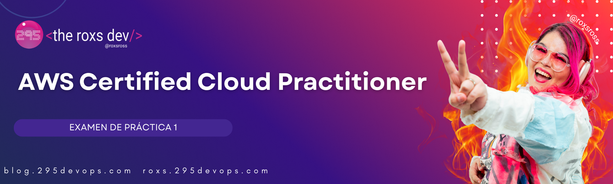

# 📝 Examen de Práctica 1 - AWS Cloud Practitioner

> **Simula la experiencia del examen real con 65 preguntas cubriendo todos los dominios**

## 📋 Instrucciones del Examen

- **Límite de Tiempo**: 90 minutos (recomendado)
- **Preguntas**: 65 de opción múltiple y respuesta múltiple
- **Puntuación para Aprobar**: 70% (46 de 65 preguntas)
- **Distribución por Dominio**: Refleja las ponderaciones del examen real
- **Formato**: Elige la MEJOR respuesta para cada pregunta

### 📊 Distribución de Preguntas por Dominio
- **Dominio 1 (Conceptos de la Nube)**: 16 preguntas (24%)
- **Dominio 2 (Seguridad y Cumplimiento)**: 20 preguntas (30%)
- **Dominio 3 (Tecnología y Servicios)**: 22 preguntas (34%)
- **Dominio 4 (Facturación y Soporte)**: 7 preguntas (12%)

---

## 🌩️ Dominio 1: Conceptos de la Nube (Preguntas 1-16)

### Pregunta 1
**¿Cuál de las siguientes opciones describe mejor la computación en la nube?**

- A) Un centro de datos físico que posees y operas
- B) Entrega bajo demanda de recursos de TI y aplicaciones a través de internet con precios de pago por uso
- C) Una red privada que conecta múltiples oficinas
- D) Software que funciona solo en computadoras locales

Haz clic para revelar la respuesta

**Respuesta: B**

**Explicación**: La computación en la nube se define como la entrega bajo demanda de recursos de TI y aplicaciones a través de internet con precios de pago por uso. Esto elimina la necesidad de invertir y mantener infraestructura física.

### Pregunta 2
**¿Cuál es un beneficio clave de la elasticidad de la computación en la nube?**

- A) Proporciona capacidad de almacenamiento ilimitada
- B) Asegura 100% de tiempo de actividad
- C) Permite escalar recursos hacia arriba o abajo según la demanda
- D) Elimina todas las preocupaciones de seguridad

Haz clic para revelar la respuesta

**Respuesta: C**

**Explicación**: La elasticidad es la capacidad de escalar recursos hacia arriba o abajo según la demanda, lo que ayuda a optimizar costos y rendimiento. No proporciona almacenamiento ilimitado, no garantiza 100% de tiempo de actividad, ni elimina las preocupaciones de seguridad.

### Pregunta 3
**¿Qué modelo de implementación combina infraestructura local con servicios en la nube?**

- A) Nube pública
- B) Nube privada
- C) Nube híbrida
- D) Nube comunitaria

Haz clic para revelar la respuesta

**Respuesta: C**

**Explicación**: Un modelo de implementación de nube híbrida combina infraestructura local con servicios en la nube, permitiendo a las organizaciones mantener algunos recursos localmente mientras aprovechan los beneficios de la nube para otros.

### Pregunta 4
**En el modelo de Infraestructura como Servicio (IaaS), ¿de qué es responsable el cliente?**

- A) Servidores físicos y equipos de red
- B) Sistemas operativos, aplicaciones y datos
- C) Instalaciones del centro de datos y energía
- D) Hipervisor y software de virtualización

Haz clic para revelar la respuesta

**Respuesta: B**

**Explicación**: En IaaS, el proveedor de la nube gestiona la infraestructura física, mientras que los clientes son responsables de gestionar sistemas operativos, aplicaciones y sus datos.

### Pregunta 5
**¿Qué es una Zona de Disponibilidad de AWS?**

- A) Una Región completa de AWS
- B) Uno o más centros de datos discretos con energía, redes y conectividad redundantes
- C) Un solo centro de datos
- D) Un área geográfica que contiene múltiples Regiones de AWS

Haz clic para revelar la respuesta

**Respuesta: B**

**Explicación**: Una Zona de Disponibilidad consiste en uno o más centros de datos discretos, cada uno con energía, redes y conectividad redundantes, ubicados en instalaciones separadas dentro de una Región de AWS.

### Pregunta 6
**¿Cuál de las siguientes NO es una de las seis ventajas de la computación en la nube según AWS?**

- A) Cambiar gastos de capital por gastos operacionales
- B) Beneficiarse de economías de escala masivas
- C) Eliminar toda la sobrecarga operacional
- D) Aumentar la velocidad y agilidad

Haz clic para revelar la respuesta

**Respuesta: C**

**Explicación**: Aunque la computación en la nube reduce la sobrecarga operacional, no elimina todas las tareas operacionales. Las organizaciones aún necesitan gestionar sus aplicaciones, datos y algunos componentes de infraestructura.

### Pregunta 7
**¿Cuál es la diferencia principal entre escalado horizontal y vertical?**

- A) El escalado horizontal agrega más servidores, el escalado vertical aumenta la capacidad del servidor
- B) El escalado horizontal es más barato, el escalado vertical es más caro
- C) El escalado horizontal es automático, el escalado vertical es manual
- D) No hay diferencia entre los dos

Haz clic para revelar la respuesta

**Respuesta: A**

**Explicación**: El escalado horizontal (escalar hacia afuera) agrega más servidores para manejar mayor carga, mientras que el escalado vertical (escalar hacia arriba) aumenta la capacidad de servidores existentes agregando más CPU, RAM o almacenamiento.

### Pregunta 8
**¿Qué servicio de AWS usarías para distribuir contenido globalmente con baja latencia?**

- A) Amazon S3
- B) Amazon CloudFront
- C) Amazon EC2
- D) Amazon RDS

Haz clic para revelar la respuesta

**Respuesta: B**

**Explicación**: Amazon CloudFront es el servicio de red de entrega de contenido (CDN) de AWS que distribuye contenido globalmente a través de ubicaciones de borde para reducir la latencia para los usuarios finales.

### Pregunta 9
**¿De qué consiste la infraestructura global de AWS? (Selecciona DOS)**

- A) Regiones
- B) Solo zonas locales
- C) Zonas de Disponibilidad
- D) Almacenes de datos
- E) Nubes privadas

Haz clic para revelar la respuesta

**Respuesta: A, C**

**Explicación**: La infraestructura global de AWS consiste principalmente en Regiones (áreas geográficas) y Zonas de Disponibilidad (centros de datos discretos dentro de las regiones). Las zonas locales y ubicaciones de borde son componentes adicionales, pero los almacenes de datos y nubes privadas no son parte del modelo de infraestructura de AWS.

### Pregunta 10
**¿Qué característica de la computación en la nube permite a los usuarios acceder a servicios desde cualquier lugar con conexión a internet?**

- A) Agrupación de recursos
- B) Acceso amplio a la red
- C) Elasticidad rápida
- D) Servicio medido

Haz clic para revelar la respuesta

**Respuesta: B**

**Explicación**: El acceso amplio a la red permite a los usuarios acceder a servicios en la nube desde cualquier lugar con conexión a internet a través de mecanismos estándar y varios dispositivos.

### Pregunta 11
**¿Cuál es la principal ventaja de usar una nube privada sobre una nube pública?**

- A) Menor costo
- B) Mayor control y seguridad
- C) Mejor rendimiento
- D) No requiere mantenimiento

Haz clic para revelar la respuesta

**Respuesta: B**

**Explicación**: Las nubes privadas ofrecen mayor control y seguridad ya que la infraestructura está dedicada a una sola organización, aunque típicamente vienen con costos más altos y requisitos de mantenimiento.

### Pregunta 12
**En Plataforma como Servicio (PaaS), ¿qué gestiona típicamente el proveedor de la nube?**

- A) Solo el hardware físico
- B) Hardware, sistema operativo y entorno de ejecución
- C) Solo las aplicaciones y datos
- D) Nada - el cliente gestiona todo

Haz clic para revelar la respuesta

**Respuesta: B**

**Explicación**: En PaaS, el proveedor de la nube gestiona el hardware, sistema operativo y entorno de ejecución, permitiendo a los clientes enfocarse en desarrollar y desplegar aplicaciones.

### Pregunta 13
**¿Cuál es el beneficio del modelo de precios de pago por uso de AWS?**

- A) Pagas una tarifa mensual fija sin importar el uso
- B) Solo pagas por los recursos que realmente usas
- C) Debes pagar por los recursos por adelantado
- D) Todos los servicios son completamente gratuitos

Haz clic para revelar la respuesta

**Respuesta: B**

**Explicación**: El modelo de precios de pago por uso de AWS significa que solo pagas por los recursos que realmente consumes, sin costos iniciales o compromisos a largo plazo (a menos que los elijas).

### Pregunta 14
**¿Cuál de las siguientes opciones describe mejor "volverse global en minutos" como una ventaja de la computación en la nube?**

- A) La capacidad de desplegar aplicaciones mundialmente de forma rápida
- B) La garantía de que las aplicaciones funcionarán en todos los países
- C) Traducción automática de aplicaciones a diferentes idiomas
- D) La capacidad de viajar a cualquier lugar del mundo

Haz clic para revelar la respuesta

**Respuesta: A**

**Explicación**: "Volverse global en minutos" se refiere a la capacidad de desplegar aplicaciones a través de múltiples Regiones de AWS mundialmente de forma rápida y fácil, alcanzando clientes globales con baja latencia.

### Pregunta 15
**¿Cuál es la diferencia entre una Región de AWS y una Ubicación de Borde?**

- A) Las Regiones son más pequeñas que las Ubicaciones de Borde
- B) Las Ubicaciones de Borde se usan para entrega de contenido, las Regiones alojan toda la gama de servicios de AWS
- C) No hay diferencia
- D) Las Ubicaciones de Borde son más caras que las Regiones

Haz clic para revelar la respuesta

**Respuesta: B**

**Explicación**: Las Ubicaciones de Borde se usan principalmente para entrega de contenido (CloudFront) y DNS (Route 53), mientras que las Regiones alojan toda la gama de servicios de AWS y son áreas geográficas más grandes con múltiples Zonas de Disponibilidad.

### Pregunta 16
**¿Qué modelo de servicio en la nube proporciona el mayor control del cliente sobre la infraestructura?**

- A) Software como Servicio (SaaS)
- B) Plataforma como Servicio (PaaS)
- C) Infraestructura como Servicio (IaaS)
- D) Función como Servicio (FaaS)

Haz clic para revelar la respuesta

**Respuesta: C**

**Explicación**: IaaS proporciona el mayor control del cliente sobre componentes de infraestructura como sistemas operativos, almacenamiento y redes, mientras que SaaS proporciona el menor control y PaaS se encuentra en el medio.

---

## 🔒 Dominio 2: Seguridad y Cumplimiento (Preguntas 17-36)

### Pregunta 17
**Según el Modelo de Responsabilidad Compartida de AWS, ¿de qué es responsable AWS?**

- A) Seguridad DE la nube
- B) Seguridad EN la nube
- C) Cifrado de datos del cliente
- D) Seguridad a nivel de aplicación

Haz clic para revelar la respuesta

**Respuesta: A**

**Explicación**: AWS es responsable de la "Seguridad DE la nube" - la infraestructura, incluyendo hardware, software, redes e instalaciones. Los clientes son responsables de la "Seguridad EN la nube" - sus datos, aplicaciones y configuraciones.

### Pregunta 18
**¿Qué servicio de AWS es la base de la gestión de identidad y acceso en AWS?**

- A) AWS Organizations
- B) AWS IAM (Identity and Access Management)
- C) AWS CloudTrail
- D) AWS Config

Haz clic para revelar la respuesta

**Respuesta: B**

**Explicación**: AWS IAM es el servicio fundamental para gestionar identidades, autenticación y autorización en AWS, permitiéndote controlar quién puede acceder a qué recursos.

### Pregunta 19
**¿Cuál es la mejor práctica para el usuario root de la cuenta de AWS?**

- A) Usarlo para tareas administrativas diarias
- B) Compartir las credenciales con miembros del equipo
- C) Habilitar MFA y usarlo solo para configuración inicial y tareas de facturación
- D) Eliminarlo después de crear otros usuarios

Haz clic para revelar la respuesta

**Respuesta: C**

**Explicación**: El usuario root debe tener MFA habilitado y usarse solo para tareas que específicamente requieren acceso root, como configuración inicial de cuenta y ciertas tareas de facturación. Las operaciones diarias deben usar usuarios IAM con permisos apropiados.

### Pregunta 20
**¿Cuál es el principio de menor privilegio en AWS IAM?**

- A) Dar a los usuarios permisos máximos por conveniencia
- B) Otorgar solo los permisos mínimos necesarios para realizar las tareas requeridas
- C) Usar solo la cuenta de usuario root
- D) Asignar todos los usuarios al mismo grupo

Haz clic para revelar la respuesta

**Respuesta: B**

**Explicación**: El principio de menor privilegio significa otorgar a usuarios, grupos y roles solo los permisos mínimos necesarios para realizar sus tareas requeridas, reduciendo los riesgos de seguridad.

### Pregunta 21
**¿Qué servicio de AWS te ayuda a monitorear y registrar llamadas API hechas a servicios de AWS?**

- A) AWS CloudWatch
- B) AWS CloudTrail
- C) AWS Config
- D) AWS Inspector

Haz clic para revelar la respuesta

**Respuesta: B**

**Explicación**: AWS CloudTrail registra llamadas API hechas a servicios de AWS, proporcionando un rastro de auditoría completo de actividad de usuario y uso de API para análisis de seguridad y cumplimiento.

### Pregunta 22
**¿Qué es la Autenticación Multi-Factor (MFA)?**

- A) Usar múltiples contraseñas
- B) Una capa adicional de seguridad que requiere algo que sabes y algo que tienes
- C) Una forma de crear múltiples cuentas de usuario
- D) Un método para cifrar datos

Haz clic para revelar la respuesta

**Respuesta: B**

**Explicación**: MFA agrega una capa extra de seguridad requiriendo que los usuarios proporcionen dos o más factores de verificación: algo que saben (contraseña) y algo que tienen (token, teléfono, etc.).

### Pregunta 23
**¿Cuál de las siguientes es un ejemplo de Federación de Identidad de AWS?**

- A) Crear usuarios IAM para cada empleado
- B) Permitir a los usuarios iniciar sesión con sus credenciales corporativas de Active Directory
- C) Usar la cuenta de usuario root
- D) Crear múltiples cuentas de AWS

Haz clic para revelar la respuesta

**Respuesta: B**

**Explicación**: La federación de identidad permite a los usuarios iniciar sesión en AWS usando sus credenciales corporativas existentes (como Active Directory) en lugar de crear usuarios IAM separados para cada persona.

### Pregunta 24
**¿Cuál es el propósito de los Grupos de Seguridad de AWS?**

- A) Organizar usuarios IAM
- B) Actuar como firewalls virtuales para instancias EC2
- C) Cifrar datos en reposo
- D) Gestionar permisos de facturación

Haz clic para revelar la respuesta

**Respuesta: B**

**Explicación**: Los Grupos de Seguridad actúan como firewalls virtuales que controlan el tráfico entrante y saliente para instancias EC2 y otros recursos de AWS, operando a nivel de instancia.

### Pregunta 25
**¿Qué servicio de AWS proporciona protección DDoS?**

- A) AWS WAF
- B) AWS Shield
- C) AWS GuardDuty
- D) AWS Inspector

Haz clic para revelar la respuesta

**Respuesta: B**

**Explicación**: AWS Shield proporciona protección DDoS para recursos de AWS. Shield Standard es gratuito y proporciona protección básica, mientras que Shield Advanced ofrece protección mejorada por una tarifa.

### Pregunta 26
**¿Cuál es la diferencia entre los roles de IAM y los usuarios de IAM?**

- A) No hay diferencia
- B) Los roles son para humanos, los usuarios son para aplicaciones
- C) Los roles son temporales y pueden ser asumidos, los usuarios tienen credenciales permanentes
- D) Los roles son más caros que los usuarios

Haz clic para revelar la respuesta

**Respuesta: C**

**Explicación**: Los roles de IAM proporcionan credenciales temporales que pueden ser asumidas por usuarios, aplicaciones o servicios, mientras que los usuarios de IAM tienen credenciales permanentes a largo plazo. Los roles se usan a menudo para aplicaciones y acceso entre cuentas.

### Pregunta 27
**¿Qué servicio de AWS ayuda a detectar amenazas y actividad sospechosa en tu entorno de AWS?**

- A) AWS CloudWatch
- B) AWS GuardDuty
- C) AWS CloudTrail
- D) AWS Config

Haz clic para revelar la respuesta

**Respuesta: B**

**Explicación**: AWS GuardDuty es un servicio de detección de amenazas que usa aprendizaje automático e inteligencia de amenazas para identificar actividad maliciosa y comportamiento no autorizado en tu entorno de AWS.

### Pregunta 28
**¿Qué protege el cifrado de datos "en tránsito"?**

- A) Datos almacenados en discos duros
- B) Datos mientras se transmiten a través de redes
- C) Datos en bases de datos
- D) Datos en respaldos

Haz clic para revelar la respuesta

**Respuesta: B**

**Explicación**: El cifrado "en tránsito" protege los datos mientras se transmiten a través de redes (como internet) entre diferentes ubicaciones o servicios, previniendo la interceptación durante la transmisión.

### Pregunta 29
**¿Para qué marco de cumplimiento está certificado AWS que es importante para organizaciones de salud?**

- A) SOC 2
- B) HIPAA
- C) PCI DSS
- D) ISO 27001

Haz clic para revelar la respuesta

**Respuesta: B**

**Explicación**: HIPAA (Ley de Portabilidad y Responsabilidad del Seguro de Salud) es crucial para organizaciones de salud que manejan información de salud protegida (PHI). AWS proporciona servicios elegibles para HIPAA y BAAs (Acuerdos de Socios Comerciales).

### Pregunta 30
**¿Cuál es el propósito de AWS Organizations?**

- A) Crear usuarios de IAM
- B) Gestionar centralmente múltiples cuentas de AWS
- C) Monitorear el rendimiento de aplicaciones
- D) Cifrar datos

Haz clic para revelar la respuesta

**Respuesta: B**

**Explicación**: AWS Organizations te permite gestionar centralmente múltiples cuentas de AWS, incluyendo consolidación de facturación, creación de cuentas y aplicación de políticas entre cuentas.

### Pregunta 31
**¿Qué servicio de AWS ayuda a asegurar que tus recursos cumplan con las políticas de la empresa y estándares de la industria?**

- A) AWS Config
- B) AWS CloudWatch
- C) AWS S3
- D) AWS EC2

Haz clic para revelar la respuesta

**Respuesta: A**

**Explicación**: AWS Config ayuda a evaluar, auditar y evaluar las configuraciones de recursos de AWS contra configuraciones deseadas y reglas de cumplimiento.

### Pregunta 32
**¿Cuál es la responsabilidad del cliente en el Modelo de Responsabilidad Compartida para Amazon S3?**

- A) Seguridad física de los centros de datos
- B) Gestionar políticas de bucket y ACLs de objetos
- C) Mantener la infraestructura del servicio S3
- D) Reemplazar discos duros fallidos

Haz clic para revelar la respuesta

**Respuesta: B**

**Explicación**: Para S3, los clientes son responsables de gestionar políticas de bucket, listas de control de acceso de objetos (ACLs), configuraciones de cifrado de datos y los datos mismos. AWS maneja la infraestructura y mantenimiento del servicio.

### Pregunta 33
**¿Cuál de las siguientes NO es un tipo de identidad de IAM?**

- A) Usuarios
- B) Grupos
- C) Roles
- D) Políticas

Haz clic para revelar la respuesta

**Respuesta: D**

**Explicación**: Las políticas no son identidades; son documentos que definen permisos. Las identidades de IAM incluyen Usuarios, Grupos y Roles. Las políticas se adjuntan a estas identidades para otorgar permisos.

### Pregunta 34
**¿Para qué se usa AWS Certificate Manager (ACM)?**

- A) Crear usuarios de IAM
- B) Gestionar certificados SSL/TLS
- C) Monitorear tráfico de red
- D) Crear grupos de seguridad

Haz clic para revelar la respuesta

**Respuesta: B**

**Explicación**: AWS Certificate Manager (ACM) aprovisiona, gestiona y despliega certificados SSL/TLS para uso con servicios de AWS y recursos conectados internos.

### Pregunta 35
**¿Qué servicio de AWS proporciona un firewall de aplicaciones web?**

- A) AWS Shield
- B) AWS WAF
- C) AWS GuardDuty
- D) AWS Inspector

Haz clic para revelar la respuesta

**Respuesta: B**

**Explicación**: AWS WAF (Web Application Firewall) protege aplicaciones web de exploits web comunes que podrían afectar la disponibilidad de la aplicación, comprometer la seguridad o consumir recursos excesivos.

### Pregunta 36
**¿Cuál es el beneficio de usar roles de AWS IAM para instancias EC2?**

- A) Proporcionan mejor rendimiento
- B) Eliminan la necesidad de almacenar credenciales a largo plazo en las instancias
- C) Son gratuitos de usar
- D) Proporcionan respaldos automáticos

Haz clic para revelar la respuesta

**Respuesta: B**

**Explicación**: Los roles de IAM para instancias EC2 eliminan la necesidad de almacenar credenciales de AWS a largo plazo en las instancias. En su lugar, las instancias reciben credenciales temporales que se rotan automáticamente.

---

## ⚙️ Dominio 3: Tecnología y Servicios en la Nube (Preguntas 37-58)

### Pregunta 37
**¿Qué es Amazon EC2?**

- A) Un servicio de base de datos
- B) Un servicio de servidores virtuales en la nube
- C) Una red de entrega de contenido
- D) Un servicio de almacenamiento

Haz clic para revelar la respuesta

**Respuesta: B**

**Explicación**: Amazon EC2 (Elastic Compute Cloud) proporciona servidores virtuales (instancias) en la nube, permitiéndote ejecutar aplicaciones y cargas de trabajo con capacidad de cómputo escalable.

### Pregunta 38
**¿Qué modelo de precios de EC2 ofrece el menor costo para cargas de trabajo tolerantes a fallos y flexibles?**

- A) Instancias On-Demand
- B) Instancias Reservadas
- C) Instancias Spot
- D) Hosts Dedicados

Haz clic para revelar la respuesta

**Respuesta: C**

**Explicación**: Las Instancias Spot ofrecen el menor costo (hasta 90% de ahorro) pero pueden ser interrumpidas por AWS cuando se necesita capacidad en otro lugar, haciéndolas adecuadas para cargas de trabajo tolerantes a fallos y flexibles.

### Pregunta 39
**¿Para qué se usa principalmente Amazon S3?**

- A) Ejecutar servidores virtuales
- B) Almacenamiento de objetos
- C) Bases de datos relacionales
- D) Entrega de contenido

Haz clic para revelar la respuesta

**Respuesta: B**

**Explicación**: Amazon S3 (Simple Storage Service) es principalmente un servicio de almacenamiento de objetos que te permite almacenar y recuperar cualquier cantidad de datos desde cualquier lugar en la web.

### Pregunta 40
**¿Qué servicio de AWS es mejor para ejecutar contenedores sin gestionar servidores?**

- A) Amazon EC2
- B) AWS Lambda
- C) Amazon ECS con Fargate
- D) Amazon RDS

Haz clic para revelar la respuesta

**Respuesta: C**

**Explicación**: Amazon ECS (Elastic Container Service) con AWS Fargate te permite ejecutar contenedores sin gestionar los servidores o clústeres subyacentes.

### Pregunta 41
**¿Qué es AWS Lambda?**

- A) Un servicio de nube privada virtual
- B) Un servicio de cómputo sin servidor que ejecuta código en respuesta a eventos
- C) Un servicio de base de datos
- D) Un servicio de monitoreo

Haz clic para revelar la respuesta

**Respuesta: B**

**Explicación**: AWS Lambda es un servicio de cómputo sin servidor que ejecuta tu código en respuesta a eventos y gestiona automáticamente los recursos de cómputo subyacentes por ti.

### Pregunta 42
**¿Qué clase de almacenamiento sería más rentable para datos de archivo que rara vez se acceden?**

- A) S3 Standard
- B) S3 Standard-IA
- C) S3 Glacier
- D) S3 One Zone-IA

Haz clic para revelar la respuesta

**Respuesta: C**

**Explicación**: S3 Glacier está diseñado para archivo a largo plazo y respaldo de datos que rara vez se acceden, ofreciendo los costos de almacenamiento más bajos pero con tiempos de recuperación más largos.

### Pregunta 43
**¿Qué es Amazon VPC?**

- A) Una nube privada virtual que te permite lanzar recursos de AWS en una red virtual aislada
- B) Una red de entrega de contenido
- C) Un servicio de base de datos
- D) Un servicio de monitoreo

Haz clic para revelar la respuesta

**Respuesta: A**

**Explicación**: Amazon VPC (Virtual Private Cloud) te permite lanzar recursos de AWS en una red virtual que defines, proporcionando control completo sobre tu entorno de redes virtuales.

### Pregunta 44
**¿Qué servicio de AWS proporciona una base de datos relacional completamente administrada?**

- A) Amazon DynamoDB
- B) Amazon RDS
- C) Amazon Redshift
- D) Amazon S3

Haz clic para revelar la respuesta

**Respuesta: B**

**Explicación**: Amazon RDS (Relational Database Service) proporciona bases de datos relacionales completamente administradas que soportan múltiples motores de base de datos como MySQL, PostgreSQL, Oracle y SQL Server.

### Pregunta 45
**¿Qué es Amazon CloudFront?**

- A) Un servicio de cómputo
- B) Una red de entrega de contenido (CDN)
- C) Un servicio de base de datos
- D) Un servicio de almacenamiento

Haz clic para revelar la respuesta

**Respuesta: B**

**Explicación**: Amazon CloudFront es una red de entrega de contenido (CDN) que distribuye contenido a usuarios mundialmente con baja latencia almacenando contenido en caché en ubicaciones de borde.

### Pregunta 46
**¿Qué servicio de AWS es mejor para bases de datos NoSQL?**

- A) Amazon RDS
- B) Amazon DynamoDB
- C) Amazon Redshift
- D) Amazon Aurora

Haz clic para revelar la respuesta

**Respuesta: B**

**Explicación**: Amazon DynamoDB es un servicio de base de datos NoSQL completamente administrado que proporciona rendimiento rápido y predecible con escalabilidad perfecta.

### Pregunta 47
**¿Cuál es la diferencia entre Amazon EBS y el almacén de instancia?**

- A) EBS es temporal, el almacén de instancia es persistente
- B) EBS es persistente, el almacén de instancia es temporal
- C) No hay diferencia
- D) EBS es más rápido que el almacén de instancia

Haz clic para revelar la respuesta

**Respuesta: B**

**Explicación**: Amazon EBS (Elastic Block Store) proporciona almacenamiento de bloques persistente que persiste más allá de la vida de una instancia, mientras que el almacén de instancia proporciona almacenamiento temporal que se pierde cuando una instancia se detiene o termina.

### Pregunta 48
**¿Qué servicio de AWS te ayuda a monitorear y recopilar métricas de recursos de AWS?**

- A) AWS CloudTrail
- B) AWS CloudWatch
- C) AWS Config
- D) AWS Inspector

Haz clic para revelar la respuesta

**Respuesta: B**

**Explicación**: Amazon CloudWatch monitorea recursos y aplicaciones de AWS, recopilando y rastreando métricas, monitoreando archivos de registro y configurando alarmas.

### Pregunta 49
**¿Qué es Amazon Route 53?**

- A) Un balanceador de carga
- B) Un servicio web DNS
- C) Una red de entrega de contenido
- D) Una nube privada virtual

Haz clic para revelar la respuesta

**Respuesta: B**

**Explicación**: Amazon Route 53 es un servicio web DNS (Sistema de Nombres de Dominio) escalable que enruta usuarios finales a aplicaciones de internet traduciendo nombres de dominio a direcciones IP.

### Pregunta 50
**¿Qué servicio de AWS proporciona balanceador de carga elástico?**

- A) Amazon EC2
- B) Elastic Load Balancing (ELB)
- C) Amazon S3
- D) Amazon VPC

Haz clic para revelar la respuesta

**Respuesta: B**

**Explicación**: Elastic Load Balancing (ELB) distribuye automáticamente el tráfico de aplicaciones entrante entre múltiples objetivos, como instancias EC2, contenedores y direcciones IP.

### Pregunta 51
**¿Qué es Amazon Aurora?**

- A) Una base de datos NoSQL
- B) Una base de datos relacional compatible con MySQL y PostgreSQL
- C) Un almacén de datos
- D) Un servicio de caché

Haz clic para revelar la respuesta

**Respuesta: B**

**Explicación**: Amazon Aurora es una base de datos relacional compatible con MySQL y PostgreSQL construida para la nube, ofreciendo rendimiento y disponibilidad de bases de datos comerciales a una fracción del costo.

### Pregunta 52
**¿Qué servicio usarías para enviar correos electrónicos desde tus aplicaciones?**

- A) Amazon SNS
- B) Amazon SQS
- C) Amazon SES
- D) Amazon Connect

Haz clic para revelar la respuesta

**Respuesta: C**

**Explicación**: Amazon SES (Simple Email Service) es un servicio de envío de correos electrónicos basado en la nube diseñado para ayudar a mercadólogos digitales y desarrolladores de aplicaciones a enviar correos de marketing, notificación y transaccionales.

### Pregunta 53
**¿Cuál es el propósito de Amazon SNS?**

- A) Servicio de correo electrónico
- B) Cola de mensajes
- C) Servicio de mensajería de publicación-suscripción
- D) Almacenamiento de archivos

Haz clic para revelar la respuesta

**Respuesta: C**

**Explicación**: Amazon SNS (Simple Notification Service) es un servicio de mensajería de publicación-suscripción que te permite desacoplar microservicios, sistemas distribuidos y aplicaciones sin servidor.

### Pregunta 54
**¿Qué servicio de AWS proporciona un servicio administrado de Kubernetes?**

- A) Amazon ECS
- B) Amazon EKS
- C) AWS Fargate
- D) AWS Lambda

Haz clic para revelar la respuesta

**Respuesta: B**

**Explicación**: Amazon EKS (Elastic Kubernetes Service) es un servicio administrado de Kubernetes que facilita ejecutar Kubernetes en AWS sin necesidad de instalar y operar tu propio plano de control de Kubernetes.

### Pregunta 55
**¿Para qué se usa Amazon Redshift?**

- A) Almacenamiento de objetos
- B) Almacenamiento de datos y análisis
- C) Entrega de contenido
- D) Servidores virtuales

Haz clic para revelar la respuesta

**Respuesta: B**

**Explicación**: Amazon Redshift es un servicio de almacén de datos completamente administrado que hace simple y rentable analizar datos usando SQL estándar y herramientas de inteligencia de negocios.

### Pregunta 56
**¿Qué servicio de AWS te ayuda a migrar bases de datos a AWS?**

- A) AWS DataSync
- B) AWS Database Migration Service (DMS)
- C) AWS Storage Gateway
- D) AWS Direct Connect

Haz clic para revelar la respuesta

**Respuesta: B**

**Explicación**: AWS Database Migration Service (DMS) te ayuda a migrar bases de datos a AWS de forma rápida y segura, manteniendo la base de datos de origen completamente operacional durante la migración.

### Pregunta 57
**¿Para qué se usa Amazon ElastiCache?**

- A) Entrega de contenido
- B) Caché en memoria
- C) Almacenamiento de archivos
- D) Servidores virtuales

Haz clic para revelar la respuesta

**Respuesta: B**

**Explicación**: Amazon ElastiCache es un servicio web que facilita desplegar, operar y escalar una caché en memoria en la nube, soportando motores Redis y Memcached.

### Pregunta 58
**¿Qué servicio de AWS proporciona gestión de API?**

- A) Amazon API Gateway
- B) AWS Lambda
- C) Amazon CloudFront
- D) Amazon Route 53

Haz clic para revelar la respuesta

**Respuesta: A**

**Explicación**: Amazon API Gateway es un servicio completamente administrado que facilita a los desarrolladores crear, publicar, mantener, monitorear y asegurar APIs a cualquier escala.

---

## 💰 Dominio 4: Facturación y Soporte (Preguntas 59-65)

### Pregunta 59
**¿Qué es el Nivel Gratuito de AWS?**

- A) Todos los servicios de AWS son gratuitos para siempre
- B) Un programa que ofrece uso gratuito de ciertos servicios de AWS por 12 meses y algunos servicios que siempre son gratuitos
- C) Solo disponible para estudiantes
- D) Solo incluye servicios de almacenamiento

Haz clic para revelar la respuesta

**Respuesta: B**

**Explicación**: El Nivel Gratuito de AWS proporciona uso gratuito de ciertos servicios de AWS por 12 meses desde la creación de la cuenta, además de algunos servicios que ofrecen niveles de uso siempre gratuitos, y pruebas para otros servicios.

### Pregunta 60
**¿Qué modelo de precios requiere un compromiso de 1 o 3 años a cambio de ahorros significativos de costos?**

- A) Instancias On-Demand
- B) Instancias Spot
- C) Instancias Reservadas
- D) Hosts Dedicados

Haz clic para revelar la respuesta

**Respuesta: C**

**Explicación**: Las Instancias Reservadas requieren un compromiso de 1 o 3 años a cambio de ahorros significativos de costos (hasta 75%) comparado con precios On-Demand.

### Pregunta 61
**¿Qué herramienta de AWS te ayuda a estimar el costo de ejecutar tu carga de trabajo en AWS?**

- A) AWS Cost Explorer
- B) AWS Pricing Calculator
- C) AWS Budgets
- D) AWS Billing Dashboard

Haz clic para revelar la respuesta

**Respuesta: B**

**Explicación**: La Calculadora de Precios de AWS te ayuda a estimar el costo de ejecutar tu carga de trabajo en AWS permitiéndote configurar servicios y ver costos mensuales estimados.

### Pregunta 62
**¿Cuál es el propósito de AWS Cost Explorer?**

- A) Estimar costos futuros
- B) Visualizar y analizar tus costos y uso de AWS a lo largo del tiempo
- C) Configurar alertas de facturación
- D) Gestionar Instancias Reservadas

Haz clic para revelar la respuesta

**Respuesta: B**

**Explicación**: AWS Cost Explorer proporciona visualizaciones y análisis de tus costos y uso de AWS a lo largo del tiempo, ayudándote a entender patrones de gasto e identificar oportunidades de optimización de costos.

### Pregunta 63
**¿Qué plan de soporte proporciona acceso 24/7 a Ingenieros de Soporte en la Nube vía teléfono y chat?**

- A) Soporte Básico
- B) Soporte para Desarrolladores
- C) Soporte Empresarial
- D) Todos los planes de soporte

Haz clic para revelar la respuesta

**Respuesta: C**

**Explicación**: Los planes de Soporte Empresarial y Soporte Enterprise proporcionan acceso 24/7 a Ingenieros de Soporte en la Nube vía teléfono y chat. El soporte Básico y para Desarrolladores tienen métodos de acceso y horarios más limitados.

### Pregunta 64
**¿Qué está incluido con el Soporte Básico de AWS?**

- A) Soporte telefónico 24/7
- B) Acceso a documentación de AWS, documentos técnicos y foros de soporte
- C) Gerente de cuenta técnica
- D) Tiempo de respuesta menor a 1 hora para problemas críticos

Haz clic para revelar la respuesta

**Respuesta: B**

**Explicación**: El Soporte Básico de AWS (gratuito con todas las cuentas) incluye acceso a documentación, documentos técnicos, foros de soporte, AWS Trusted Advisor (verificaciones básicas) y AWS Personal Health Dashboard.

### Pregunta 65
**¿Qué característica te ayuda a rastrear tus costos de AWS organizando recursos usando etiquetas?**

- A) AWS Organizations
- B) Etiquetas de asignación de costos
- C) AWS Config
- D) AWS CloudTrail

Haz clic para revelar la respuesta

**Respuesta: B**

**Explicación**: Las etiquetas de asignación de costos son etiquetas que puedes asignar a recursos de AWS para organizar y rastrear costos. Aparecen en reportes de costos y te ayudan a entender el gasto por proyecto, departamento u otras dimensiones de negocio.

---

## 📊 Examen de Práctica 1 - Clave de Respuestas

### Dominio 1: Conceptos de la Nube (16/16)
1. B | 2. C | 3. C | 4. B | 5. B | 6. C | 7. A | 8. B | 9. A,C | 10. B | 11. B | 12. B | 13. B | 14. A | 15. B | 16. C

### Dominio 2: Seguridad y Cumplimiento (20/20)
17. A | 18. B | 19. C | 20. B | 21. B | 22. B | 23. B | 24. B | 25. B | 26. C | 27. B | 28. B | 29. B | 30. B | 31. A | 32. B | 33. D | 34. B | 35. B | 36. B

### Dominio 3: Tecnología y Servicios en la Nube (22/22)
37. B | 38. C | 39. B | 40. C | 41. B | 42. C | 43. A | 44. B | 45. B | 46. B | 47. B | 48. B | 49. B | 50. B | 51. B | 52. C | 53. C | 54. B | 55. B | 56. B | 57. B | 58. A

### Dominio 4: Facturación y Soporte (7/7)
59. B | 60. C | 61. B | 62. B | 63. C | 64. B | 65. B

---

## 🎯 Guía de Puntuación

**Calcula tu puntuación:**
- Cuenta las respuestas correctas: ___/65
- Porcentaje: (Respuestas correctas ÷ 65) × 100 = ___%
- **Puntuación para Aprobar**: 70% (46/65 correctas)

### 📈 Análisis de Rendimiento

**90-100% (59-65 correctas)**: ¡Excelente! Estás bien preparado para el examen.
**80-89% (52-58 correctas)**: Buen rendimiento. Revisa las áreas donde fallaste preguntas.
**70-79% (46-51 correctas)**: Nivel de aprobación. Enfócate en dominios débiles antes de tomar el examen real.
**Menos de 70% (<46 correctas)**: Se necesita más estudio. Revisa los materiales de estudio y retoma los exámenes de práctica.

### 🎯 Próximos Pasos

**Si obtuviste 80%+:**
- Toma el [Examen de Práctica 2](practice-exam-2.md)
- Revisa la [Guía de Referencia Rápida](../quick-reference/service-cheatsheet.md)
- Enfócate en las áreas donde fallaste preguntas

**Si obtuviste 70-79%:**
- Revisa los dominios donde obtuviste puntuación baja
- Retoma los quizzes de capítulos relevantes
- Toma este examen de práctica nuevamente en unos días

**Si obtuviste menos de 70%:**
- Regresa a los materiales de estudio
- Enfócate en conceptos fundamentales
- Toma quizzes de capítulos antes de intentar otro examen de práctica

---

## 📚 Recursos de Estudio

- 🏠 [Guía de Estudio Principal](../README.md)
- 🌩️ [Dominio 1: Conceptos de la Nube](../01-cloud-concepts/README.md)
- 🔒 [Dominio 2: Seguridad y Cumplimiento](../02-security-compliance/README.md)
- ⚙️ [Dominio 3: Tecnología y Servicios](../03-technology-services/README.md)
- 💰 [Dominio 4: Facturación y Soporte](../04-billing-support/README.md)
- 📝 [Examen de Práctica 2](practice-exam-2.md)
- 🚀 [Referencia Rápida](../quick-reference/service-cheatsheet.md)

---

*¡Buena suerte con tus estudios continuos! 🌟*

### Pregunta 6
**¿Cuál de los siguientes es un beneficio del modelo de responsabilidad compartida de AWS?**

- A) AWS es responsable de toda la seguridad
- B) El cliente es responsable de toda la seguridad
- C) AWS asegura la infraestructura, el cliente asegura sus datos y aplicaciones
- D) No hay responsabilidades de seguridad para ninguna de las partes

Haz clic para revelar la respuesta

**Respuesta: C**

**Explicación**: En el modelo de responsabilidad compartida, AWS es responsable de la "seguridad DE la nube" (infraestructura), mientras que el cliente es responsable de la "seguridad EN la nube" (datos, aplicaciones, configuraciones).

### Pregunta 7
**¿Qué servicio de AWS proporciona una red privada virtual en la nube?**

- A) Amazon S3
- B) Amazon VPC
- C) Amazon EC2
- D) Amazon RDS

Haz clic para revelar la respuesta

**Respuesta: B**

**Explicación**: Amazon VPC (Virtual Private Cloud) permite crear una red privada virtual en la nube de AWS, proporcionando control completo sobre el entorno de red virtual.

### Pregunta 8
**¿Cuál es la principal ventaja de usar Amazon CloudFront?**

- A) Almacenamiento de bases de datos
- B) Procesamiento de cómputo
- C) Entrega de contenido con baja latencia a nivel global
- D) Gestión de identidades

Haz clic para revelar la respuesta

**Respuesta: C**

**Explicación**: Amazon CloudFront es un servicio de red de entrega de contenido (CDN) que entrega contenido a usuarios finales con baja latencia y altas velocidades de transferencia a nivel global.

---

## 🔒 Dominio 2: Seguridad y Cumplimiento (Preguntas 9-28)

### Pregunta 9
**¿Cuál es el propósito principal de AWS IAM?**

- A) Monitorear el rendimiento de las aplicaciones
- B) Gestionar identidades y controlar el acceso a recursos de AWS
- C) Proporcionar almacenamiento de archivos
- D) Crear redes virtuales

Haz clic para revelar la respuesta

**Respuesta: B**

**Explicación**: AWS IAM (Identity and Access Management) es el servicio que permite gestionar de forma segura el acceso a servicios y recursos de AWS, controlando quién puede acceder a qué recursos.

### Pregunta 10
**¿Qué es una política de IAM?**

- A) Un documento que define permisos para usuarios, grupos o roles
- B) Una configuración de red
- C) Un tipo de instancia EC2
- D) Un método de cifrado

Haz clic para revelar la respuesta

**Respuesta: A**

**Explicación**: Una política de IAM es un documento JSON que define permisos, especificando qué acciones están permitidas o denegadas en qué recursos de AWS.

### Pregunta 11
**¿Cuál es la mejor práctica para la cuenta raíz de AWS?**

- A) Usarla para todas las tareas administrativas diarias
- B) Compartir las credenciales con el equipo
- C) Habilitar MFA y usarla solo para tareas que requieren acceso de cuenta raíz
- D) Crear múltiples cuentas raíz para diferentes departamentos

Haz clic para revelar la respuesta

**Respuesta: C**

**Explicación**: La mejor práctica es habilitar MFA en la cuenta raíz y usarla solo para tareas específicas que requieren acceso de cuenta raíz, creando usuarios IAM para el trabajo diario.

### Pregunta 12
**¿Qué servicio proporciona protección DDoS administrada para aplicaciones AWS?**

- A) AWS WAF
- B) AWS Shield
- C) AWS GuardDuty
- D) AWS Inspector

Haz clic para revelar la respuesta

**Respuesta: B**

**Explicación**: AWS Shield es un servicio de protección DDoS administrado que protege las aplicaciones que se ejecutan en AWS contra ataques de denegación de servicio distribuido.

---

## 💻 Dominio 3: Tecnología y Servicios (Preguntas 13-34)

### Pregunta 13
**¿Cuál es la diferencia principal entre Amazon S3 y Amazon EBS?**

- A) S3 es para almacenamiento de bloques, EBS es para almacenamiento de objetos
- B) S3 es para almacenamiento de objetos, EBS es para almacenamiento de bloques
- C) No hay diferencia, son el mismo servicio
- D) S3 es solo para archivos pequeños, EBS es para archivos grandes

Haz clic para revelar la respuesta

**Respuesta: B**

**Explicación**: Amazon S3 proporciona almacenamiento de objetos para archivos y datos no estructurados, mientras que Amazon EBS proporciona almacenamiento de bloques que se puede adjuntar a instancias EC2.

### Pregunta 14
**¿Cuándo sería más apropiado usar AWS Lambda en lugar de Amazon EC2?**

- A) Para aplicaciones que requieren servidores dedicados
- B) Para funciones de corta duración activadas por eventos
- C) Para bases de datos relacionales
- D) Para almacenamiento de archivos

Haz clic para revelar la respuesta

**Respuesta: B**

**Explicación**: AWS Lambda es ideal para funciones de corta duración activadas por eventos, ya que es serverless y se factura solo por el tiempo de ejecución, mientras que EC2 es mejor para aplicaciones de larga duración.

### Pregunta 15
**¿Qué servicio de AWS es mejor para una base de datos NoSQL completamente administrada?**

- A) Amazon RDS
- B) Amazon DynamoDB
- C) Amazon Redshift
- D) Amazon Aurora

Haz clic para revelar la respuesta

**Respuesta: B**

**Explicación**: Amazon DynamoDB es un servicio de base de datos NoSQL completamente administrado que proporciona rendimiento rápido y predecible con escalabilidad automática.

---

## 💰 Dominio 4: Facturación y Soporte (Preguntas 16-22)

### Pregunta 16
**¿Cuál es el beneficio principal de las Instancias Reservadas de Amazon EC2?**

- A) Mejor rendimiento que las instancias On-Demand
- B) Ahorros significativos de costos a cambio de un compromiso de 1 o 3 años
- C) Acceso a tipos de instancia exclusivos
- D) Escalado automático incluido

Haz clic para revelar la respuesta

**Respuesta: B**

**Explicación**: Las Instancias Reservadas ofrecen ahorros significativos de costos (hasta 75%) comparado con precios On-Demand a cambio de un compromiso de 1 o 3 años.

### Pregunta 17
**¿Qué incluye el nivel gratuito de AWS?**

- A) Uso ilimitado de todos los servicios por 12 meses
- B) Uso limitado de servicios seleccionados por 12 meses, más ofertas siempre gratuitas
- C) Solo servicios de almacenamiento gratuitos
- D) Acceso gratuito solo para estudiantes

Haz clic para revelar la respuesta

**Respuesta: B**

**Explicación**: El nivel gratuito de AWS incluye uso limitado de servicios seleccionados por 12 meses para nuevos clientes, más ofertas siempre gratuitas y ofertas de prueba a corto plazo.

### Pregunta 18
**¿Qué herramienta ayuda a estimar los costos de AWS antes de implementar recursos?**

- A) AWS Cost Explorer
- B) AWS Budgets
- C) AWS Pricing Calculator
- D) AWS Billing Dashboard

Haz clic para revelar la respuesta

**Respuesta: C**

**Explicación**: AWS Pricing Calculator es una herramienta web que permite estimar el costo de usar servicios de AWS para casos de uso específicos antes de la implementación.

---

## 📊 Resumen del Examen

### Puntuación y Retroalimentación

**Para calcular tu puntuación:**
1. Cuenta el número de respuestas correctas
2. Divide por el número total de preguntas (18 en esta muestra)
3. Multiplica por 100 para obtener el porcentaje

**Rangos de Puntuación:**
- **90-100%**: ¡Excelente! Estás muy bien preparado
- **80-89%**: Muy bien, revisa las áreas donde fallaste
- **70-79%**: Buen progreso, necesitas más estudio
- **Menos de 70%**: Necesitas más preparación antes del examen

### Áreas de Enfoque por Dominio

**Si tuviste dificultades con:**

**Dominio 1 (Conceptos de la Nube):**
- Revisa los beneficios de la nube y modelos de implementación
- Estudia la infraestructura global de AWS
- Practica escenarios de migración

**Dominio 2 (Seguridad):**
- Enfócate en IAM y el modelo de responsabilidad compartida
- Estudia los servicios de seguridad de AWS
- Practica configuraciones de seguridad

**Dominio 3 (Tecnología):**
- Revisa los servicios principales: EC2, S3, RDS, Lambda
- Estudia cuándo usar cada servicio
- Practica arquitecturas de soluciones

**Dominio 4 (Facturación):**
- Estudia los modelos de precios
- Revisa las herramientas de gestión de costos
- Practica estimaciones de costos

---

## 🎯 Próximos Pasos

1. **Revisa las respuestas incorrectas** - Entiende por qué la respuesta correcta es mejor
2. **Estudia las áreas débiles** - Enfócate en los dominios donde tuviste más errores
3. **Toma más exámenes de práctica** - Practica con diferentes tipos de preguntas
4. **Revisa la documentación oficial** - Consulta la documentación de AWS para detalles específicos
5. **Programa tu examen** - Cuando consistentemente obtengas 80%+ en exámenes de práctica

¡Buena suerte en tu preparación para el AWS Cloud Practitioner! 🚀